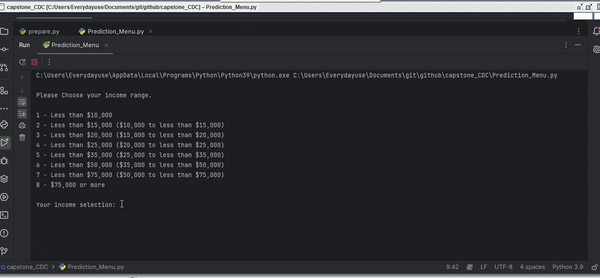

 

 
  

<h1 align="center"> Diabetis Predictor </h1>
<h3 align="center"> Python Developer Capstone 1</h3>
<h5 align="center"> Python Developer Career Training Course <a href="https://www.nwmissouri.edu/pdcenter/courses/python-developer.htm">Northwest Missouri State University</a>  (2024) </h5>

 

I have built a Supervised Learning Classification model to predict the probabilty of diabetis given age and physical activity data.  Will be using Python to feed data into my Machine Learning model to obtain my diabetes prediction.

<h2>Workflow: </h2>

<ul>
   
  <li>
Frame my Hypothesis: 

      
Increase exercise and healthier eating habits can lessen the probabilty of developing diabetes for all ages

  </li>
  <li>
Prepare my data: <a href="https://github.com/yourexodus/capstone_CDC/blob/main/GettingToKnowTheData.ipynb">GettingToKnowTheData</a>
   
      
 Jupyter Notebook

  </li>
  <li>
 Addressing Issues: Outliers and Labels <a href="https://github.com/yourexodus/capstone_CDC/blob/main/Feature_Engineering.ipynb">Feature_Engineering.ipynb</a>

        
 Jupyter Notebook

  </li>
  <li>
Analyze using visuals and make some determinations: <a href="https://github.com/yourexodus/capstone_CDC/blob/main/Visualizing%20and%20Interpreting%20Data.ipynb">Visualizing and Interpretting Data</a>
   
      
 Jupyter Notebook

  </li>
   
  
  <li>
Communicate Results -- Added Notes in files.  Emailed. Feedback Received 07/24

      
 Jupyter Notebook

     
  </li>
    
 <li>
Logistic and Random Forest: <a href="https://github.com/yourexodus/capstone_CDC/blob/main/Feature_Engineering.ipynb">Modeling</a>
   
      
 Jupyter Notebook

  </li>

  
  <li>
Short Prediction Program <a href="https://github.com/yourexodus/capstone_CDC/blob/main/Prediction_Menu.py">Prediction_Menu.py</a>
. Test using Pycharm Terminal   
       
 Pycharm Terminal  

  </li>
  <li>
      
Building and Testing interactive Graphs <a href="https://github.com/yourexodus/capstone_CDC/blob/main/Plotly_Dash_Interactive_Graphs.ipynb">Plotly_Dash_Interactive_Graphs.ipynb</a> 

      
Jupyter Notebook
 
  </li>
  <li>
      
Tested Callback using dash <a href="https://github.com/yourexodus/capstone_CDC/blob/main/Html_Testing.ipynb">Html_Testing.ipynb</a> 

      
Jupyter Notebook

  </li>
  <li> 
Add interactive Graphs to method in Class <a href="https://github.com/yourexodus/capstone_CDC/blob/main/prepare.py">prepare.py</a> 

      
Jupyter Notebook

  </li>
  <li>
Built app file <a href="https://github.com/yourexodus/capstone_CDC/blob/main/capstoneCDC_app.py"> capstoneCDC_app.py</a>
    
      
Jupyter Notebook

  </li>
   <li>
      
Deployed to Render 08/11>

      
Render: .  PLEASE NOTE:  apps will work on my local computer but will not display prediciton for some reason on render

      
  </li>
   <li>
My render <a href="https://sunday-1szf.onrender.com">Web App</a>

    <li>

</li>
</ul>

 
<h2>References</h2>
<ul>
   
  <li>
Design Inspiration, Author:Mohammad Amin Shamshiri 

      
link: https://raw.githubusercontent.com/yourexodus/Spam-Detector/master/README.md

  </li>
  <li>
Generate a New SSH key and added it to Github 

      
link: https://www.youtube.com/watch?v=X40b9x9BFGo 

  </li>
  <li>
Gemini - Used AI to generate cat Images and to learn How to deploy my Prediction model

      
link:  https://gemini.google.com

  </li>
  <li>
Canva,  create my gif file using my cat images from Gemini

      
link: https://www.canva.com 

  </li>
  <li>
Udemy.com - Online course 

      
course:How to use ChatGPT and Generative AI to help create content

      
course:Build an Interactive Data Analytics Dashboard with Python

      
  
  </li>
  <li>
Ploty Dash Dropdowns  

      
<a href="https://dash.plotly.com/persistence">Saving User Input</a>  
 
  </li>
</ul>
<h2> Available CDC Data </h2> 
<ul>
       https://archive.ics.uci.edu/dataset/891/cdc+diabetes+health+indicators   
       	https://archive.ics.uci.edu/static/public/891/data.csv*  
        https://www.cdc.gov/brfss/annual_data/annual_2014.html     
         https://www.cdc.gov/brfss/annual_data/2014/pdf/CODEBOOK14_LLCP.pdf  
   
  

</ul>

 <H2>Data Codes</H2>
<ul>
<table>
  <thead>
    <tr>
      <th>Data: Education Level codes:</th>
    </tr>
  </thead>
  <tbody>
    <tr>
      <td>1 Never attended school or only kindergarten</td>
    </tr>
    <tr>
      <td>2 Grades 1 through 8 (Elementary)</td>
    </tr>
    <tr>
      <td>3 Grades 9 through 11 (Some high school)</td>
    </tr>
    <tr>
      <td>4 Grade 12 or GED (High school graduate)</td>
    </tr>
    <tr>
      <td>5 College 1 year to 3 years (Some college or technical school)</td>
    </tr>
    <tr>
      <td>6 College 4 years or more (College graduate)</td>
    </tr>
    <tr>
      <td>9 Refused</td>
    </tr>
    <tr>
      <td>BLANK Not asked or Missing 1,770</td>
    </tr>
  </tbody>
</table>

<table>
  <thead>
    <tr>
      <th>General Health Codes</th>
      <th>Mental health code</th>
      <th>Number of Days Physical Health Not Good</th>
    </tr>
  </thead>
  <tbody>
    <tr>
      <td>1 Excellent</td>
      <td>1 - 30 Number of days</td>
      <td>1 - 30 Number of days</td>
    </tr>
    <tr>
      <td>2 Very good</td>
      <td>88 None</td>
      <td>88 None</td>
    </tr>
    <tr>
      <td>3 Good</td>
      <td>77 Don’t know/Not sure</td>
      <td>77 Don’t know</td>
    </tr>
    <tr>
      <td>4 Fair</td>
      <td>99 Refused</td>
      <td>99 Refused</td>
    </tr>
    <tr>
      <td>5 Poor</td>
      <td>&nbsp;</td>
      <td>&nbsp;</td>
    </tr>
    <tr>
      <td>7 Don’t</td>
      <td>know/Not Sure</td>
      <td>&nbsp;</td>
    </tr>
    <tr>
      <td>9 Refused</td>
      <td>&nbsp;</td>
      <td>&nbsp;</td>
    </tr>
    <tr>
      <td>&nbsp;</td>
      <td>&nbsp;</td>
      <td>&nbsp;</td>
    </tr>
  </tbody>
</table>

<table>
  <thead>
    <tr>
      <th>Difficulty Walking or Climbing Stairs (DiffWalk)</th>
      <th>Income</th>
    </tr>
  </thead>
  <tbody>
    <tr>
      <td>1 - 30 Number of days</td>
      <td>1  - Less than $10,000</td>
    </tr>
    <tr>
      <td>88 None</td>
      <td>2  - Less than $15,000 ($10,000 to less than $15,000)</td>
    </tr>
    <tr>
      <td>77 Don’t know/Not sure</td>
      <td>3  - Less than $20,000 ($15,000 to less than $20,000)</td>
    </tr>
    <tr>
      <td>99 Refused</td>
      <td>4  - Less than $25,000 ($20,000 to less than $25,000)</td>
    </tr>
    <tr>
      <td>&nbsp;</td>
      <td>5 -  Less than $35,000 ($25,000 to less than $35,000)</td>
    </tr>
    <tr>
      <td>&nbsp;</td>
      <td>6  - Less than $50,000 ($35,000 to less than $50,000)</td>
    </tr>
    <tr>
      <td>&nbsp;</td>
      <td>7 - Less than $75,000 ($50,000 to less than $75,000)</td>
    </tr>
    <tr>
      <td>&nbsp;</td>
      <td>8  - $75,000 or more</td>
    </tr>
    <tr>
      <td>&nbsp;</td>
      <td>77 -  Don’t know/Not sure</td>
    </tr>
    <tr>
      <td>&nbsp;</td>
      <td>99  - Refused</td>
    </tr>
  </tbody>
</table>
</ul>
<h2>My Journal</h2>
<ul>
<table>
  <thead>
    <tr>
      <th>Date</th>
      <th>progress</th>
      <th>accomplishment</th>
    </tr>
  </thead>
  <tbody>
    <tr>
      <td>07/22</td>
      <td>Capstone project was approved.  worked on importing data setting up environment: git, github, jupyter notebook.  Created new repository</td>
      <td>Overcame SSH errors when using commit line cmd.  Just decided to upload my files to my repository</td>
    </tr>
    <tr>
      <td>07/23</td>
      <td>I used AI to generate images .  Super cool! I had a lot of trial and error.  I decided just to take crash course on udemy how to do it.</td>
      <td>Created a git file</td>
    </tr>
    <tr>
      <td>07/24</td>
      <td>Worked on exploring my data and researching techniques to saving model for scoring of new data</td>
      <td>Created 3 jupyter notebook files</td>
    </tr>
    <tr>
      <td>07/25</td>
      <td>Feature engineering my data by adding labels and export files I can use in a dashboard. continuation of what I learned yesterday in saving my model to a pickle file in 1 notebook and load and use it in another.     When I reloaded, I only reloaded my Random Forest model because it out performed my logistic model.</td>
      <td>Created more jupyter notebook files.  Figured out how to save & Reloaded & score new data using Pickle files</td>
    </tr>
    <tr>
      <td>07/26</td>
      <td>Fixed SSH issues with Github. Followed the steps in a youtube video. Added link above.  Created program and Ran in Pycharm.  Program displays a menu in the terminal and attempts to use Pickel file load to make a prediction.  Failed. As a result, I have decided to switch gears from pickel files. I have found a udemy class that will show me how to encapsulate models into classes in jupyter notebook and use them in pycharm
</td>
      <td>Deleted my repository folder and recloned to my local drive. Now able to use git cmd (add, commit , push, pull) in GitBash to update my repository in Githubs</td>
    </tr>
    <tr>
      <td>07/26</td>
      <td>Housekeeping. Using a virtural environment I created using conda.   Touched all the files today. Even created some dashboard data files. Updated some graphs. Started a python file just for functions.</td>
      <td>Started a udemy course that is given me life!  Its soooo good!  I am loving my training right now.  Its going to show me how to use my prediction to score new data</td>
    </tr>
    <tr>
      <td>07/27</td>
      <td>Housekeeping Feature Engineering. Added betters graphs. Created functions for my data cleanup and transformations in jupyter notebook.  Saved file as *py
</td>
      <td> methods:
download_data(x) - reads a URL and returns dataframe
write_data(data, directory, **kwargs) - reads dictionary of dataframes and directory path.  writes each dataframe as a csv to the path on my local drive
read_local_data(name, directory) - reads partial file name and directory.  returns 1 csv and return a csv
run() - I defined a list of names and a empty dictionary. Loop thru the name and in each interation,  Call method read_local_data(name, path). add the csv it return to the dictionary.  when done, return the entire dictonary
select_columns(df) - defines a list with  fewer column names.  Read in dataframe  Returns dataframe with only the columns in list
run2() - includes everything from run() but added select_columns(df)
update_labels(df) - Went thru my Feature Engineering.ipynb and extracted all cells that updated columns name and added them here.  Input dataframe.  Return dataframe with updated columns names
run3() - includes everything from run2() but added update_labels(df)
group_data(df,x,y) - read dataframe. returns table. idendified a good chart i wanted to pull in my dashbarod.  Covert it to dataframe output using Gemini(AI).  added code here.  Added parameters for x and y
run4() - includes everything from run3() but added group_data(df,"GeneralHealth","Type")
run5() - includes everything from run3() but added group_data(df,"income","Type")
run6() - includes everything from run3() but added group_data(df,"education","Type")
Testing all functions at the bottm in the Feature_Engineering.ipynb
Saved all methods/functions to a file  called my_functions.ipynb
in juypter notebook saved prepared_cdc.ipynb as my_functions.py. Now, my file is a module.  Then I added class PreparedData_CDC to add all my methods to this class</td>
    </tr>
    <tr>
      <td>07/28/24</td>
      <td> update later counts and percentages of x,y in a DataFrames
cut& paste all  my methods in a *.py file using pycharm
added initialization parameter: download_new and added a self argument to all my run methods.  

Testing my classs in my Modeling.ipynb notebook
pip install scikit-learn

Added Random Forest model to class
tested and was able to a predicted a result in jupyter notebook
Added the method to my class
Tested in my Prediction_Menu.py program. Did a screen capture and uploaded 
the video to github
 </td>
      <td>I built a class with methods and I scored new data using user input</td>
    </tr>
    <tr>
      <td>07/30/24</td>
      <td>Created Plotly Dash notebook.  Created and test interactive graphs in functions file.  Automated graphs by adding them to functions/methods in  my_functions.ipynb and prepare.py files
graph_df(df, x, y) - input:dataframe, column name for x and y. returns graph

cdc_bar_plot2(df,x,y,t):input:dataframe, column name for x and y, graph title flag. returns interactive graph
cdc_bar_plot(df,x,y,t):input:dataframe, column name for x and y, graph title flag. returns interactive graph with margin
 
run_cdc_pred_compart(): input: none.  read local file and returns figure of pred vs actual    
    </td>
      <td>Completed testing of several interactive graphs. Ready to start buiding a small dashboard that will take user input and display a prediction</td>
    </tr>
    <tr>
      <td>08/01/24</td>
      <td> I have completed some interactive graphs using plotly dash.  Now I am placing them in containers for display on my dashboard using %%html magic command in jupyter notebook.</td>
      <td>constructed a table element, link  and title.  Added to my dashboard app in jupyter notebook.</td>
    </tr>
    <tr>
      <td>08/05/24</td>
      <td>Great day!  I finally figured callbacks in plotly dash.  I also found out how to store my values in my dropdowns.  I have been trying to figure that out for the past 3 days.  Its called persistence.  check it out at https://dash.plotly.com/persistence.  I am ready to launch.  This project had its highs and low but I learned alot and I am super proud of myself!  This was very challenging </td>
      <td>&nbsp;</td>
    </tr>
    <tr>
      <td>08/07/24</td>
      <td>Completed building my app file.  Attempted to launch using Render. Epic fail.  Issue:  gif file will not run in python
solution: resaved files as mp4. used html.Iframe tag

  Issue pycharm libraries : dash not recongnized
  solution:uninstall/reinstall     pip install dash==2.3.1

failing deployment using render
reference:
https://www.youtube.com/watch?v=XWJBJoV5yww

issue:  callback for graphs missing data
solution: added missing data

issue:pycharm not recognized Dash
solution: pip install jupyter-dash==0.4.2
from jupyter_dash import JupyterDash
pip install dash jupyter-dash
# For standalone web app
app = dash.Dash(__name__)

closed out . opened new pycharm with small program using flask.  rebuilt from there
EPIC FAIL  -- 08/07/24</td>
      <td>Added more interactive graphs.  had to modify the fields on my summary table to provide necessary data to recreate the graph in the callback function.  Did that and the callback functions works!</td>
    </tr>
    <tr>
      <td>08/11/24</td>
      <td>issues: mixed old and new packages in my requirements file. This called compatibility issues.  Also, I needed to add all the contents of my prepared.py class file to my app.py file. Upgraded packages using pycharm terminal.  Relied on Gemini (AI) to confirm compatibility of my packages.
Packages:
pip install --use-pep517 dash==2.17.1 dash_bootstrap_components==1.6.0 dash_table==5.0.0 matplotlib==3.9.1.post1 numpy==1.24.2 pandas==1.5.3 Pillow==10.4.0 plotly==5.23.0 scikit_learn==1.5.1 gunicorn dash-tools. 
I did have to use a new repository to deploy my app to render using a dash-tools utility
I called the repository Sunday because I completed my deployment on Sunday.  My deployment launches ok but will not reload.  I failed to launch on PythonAnywhere and failed but I found the error descriptions were more informative. I will circle back to try and fix my reload issue. 
     </td>
      <td>web app : https://sunday-1szf.onrender.com/</td>
    </tr>
    <tr>
      <td>&nbsp;</td>
      <td>&nbsp;</td>
      <td>&nbsp;</td>
    </tr>
  </tbody>
</table>
</ul>
